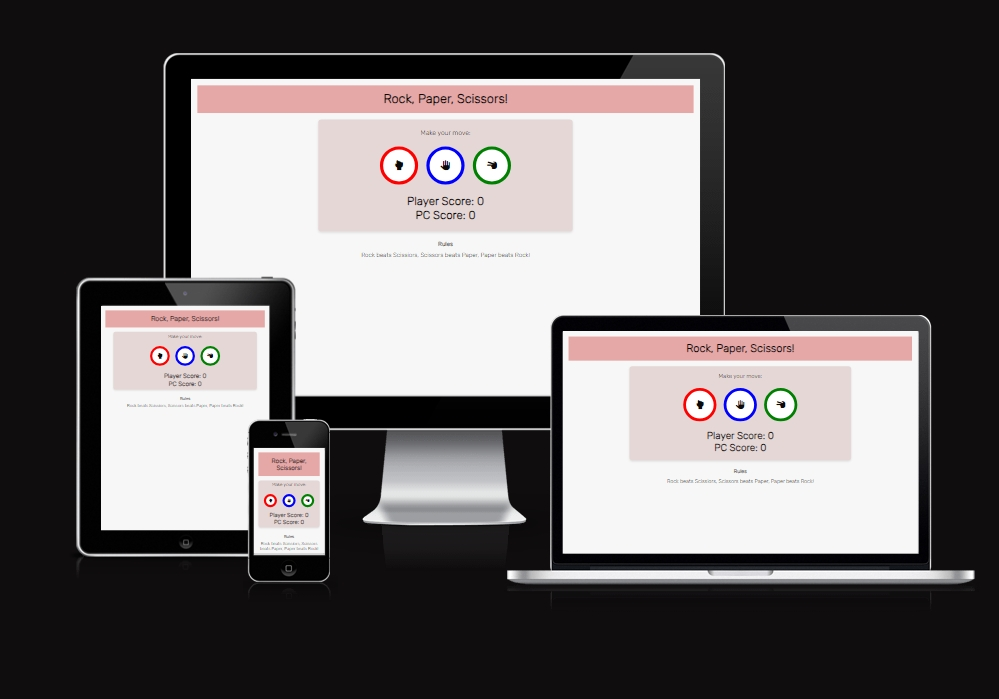
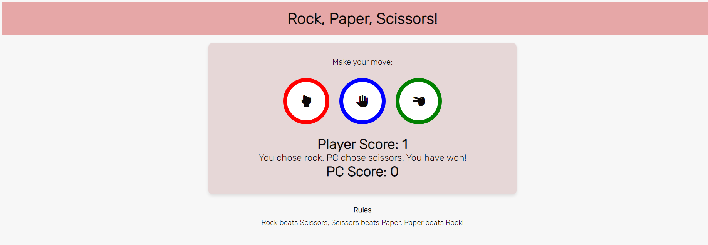
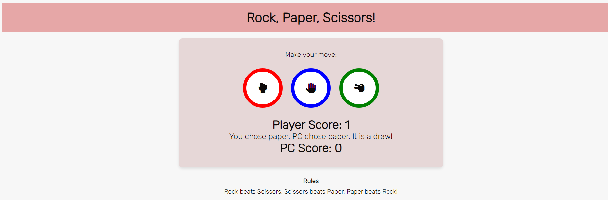
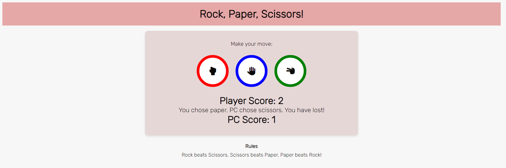
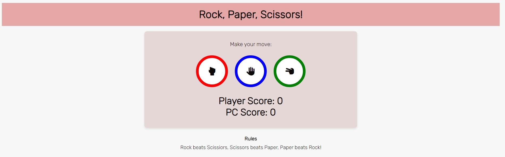
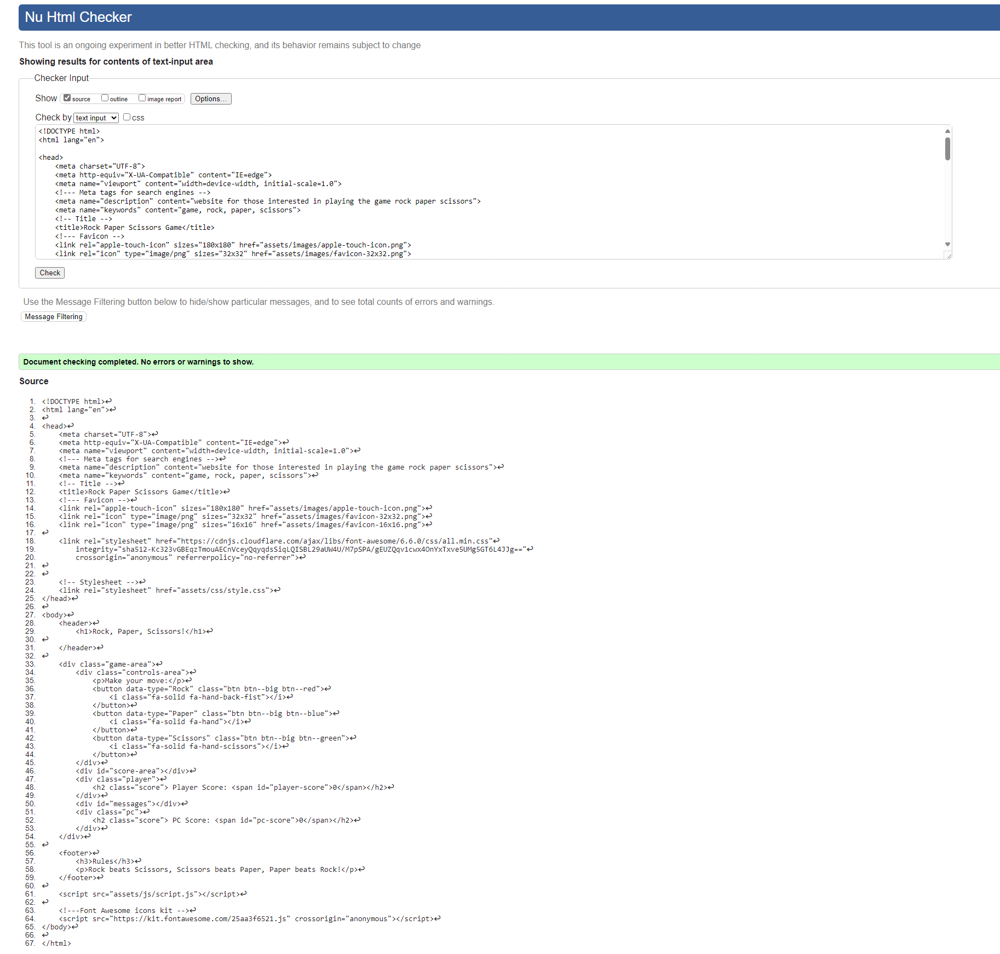
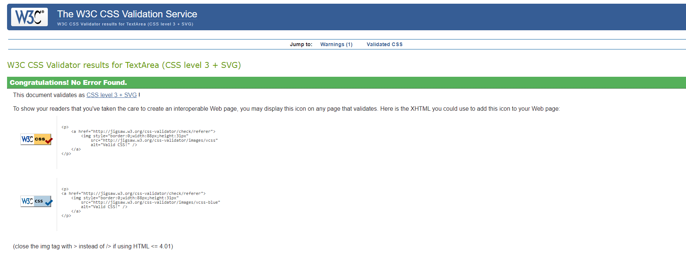
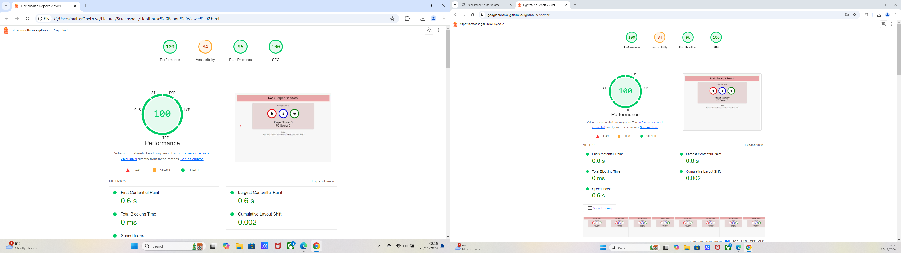

# Rock, Paper, Scissors!

Rock, Paper, Scissors is a game that can be played by almost people of any age. This website allows friends, family, or even people having a spare 10-15mins on their dinner break, to particapte in a classic game of rock paper scissors against the computer.

This is a one page website using contrasting colours such as pink, grey and white. the rock paper scissors icons have bright colours of red, blue and green to further distinguish the differences between the choices.

Welcome to [Rock, Paper, Scissors!](https://mattwass.github.io/Project-2/)

## Features:

- Header 
  - The Header displays the title of the game, using a salmon pink colour.

- The Game Area 
  - This section diplays the choice of either Rock, Paper or Scissors to go up against the computer.
  - Upon clicking the relavant action, the computer will also show what they have chosen. Whoever has won will receive a point.
  - This can be seen in the exmaple below. where we can see thatthe player won the game, as a they chose rock, whereas the computer chose scissors. "You have won!" is then displayed to confirm that the player has won that round.

  

  - This time we can see in the image below that it is a draw as both the player and the PC chose paper. 

   

    - This time we can see in the image below that the Computer has won and the player has lost. 

    

- The Outcome
  - The winner is defined by answering the correct outcome to a given match up, this naturally creates a losing side.
  - If both sides select the same choice then result is defined as a draw.

- The Footer
  - Down the bottom of the page the rules can be seen, displaying how one would win depending upon the choices they select.
  - Rock beats Scissors, Scissors beats Paper and Paper beats Rock.

## Testing
- I have tested that the webpage works in different browsers: 
  - Microsoft Edge
  - Google Chrome
  - Mozilla Firefox

- I can confirm that the webpage is responsive on various screen sizes, using the devtools device toolbar. I tested this with an iphone 12 pro and an iphone 14 pro max in devtools.
- I can confirm  that all sections of the webpage are clear, easy to read and understand.

### Bugs

Solved Bugs
- 

### Validation

- HTML
  - The webpage passes in the html validator

  

- CSS
  - The webpage passes in the css jigsaw validator 

 

 - JavaScript

- Accessibility:
  - The webpage scores relatively well in the lighthouse report

### Unfixed Bugs

## Deployment

## Acknowledgements

### Content

### Media

- Font Awesome Icons from [Font Awesome Icons](https://fontawesome.com/icons)
- Google Font from [Google Fonts](https://fonts.google.com/)

