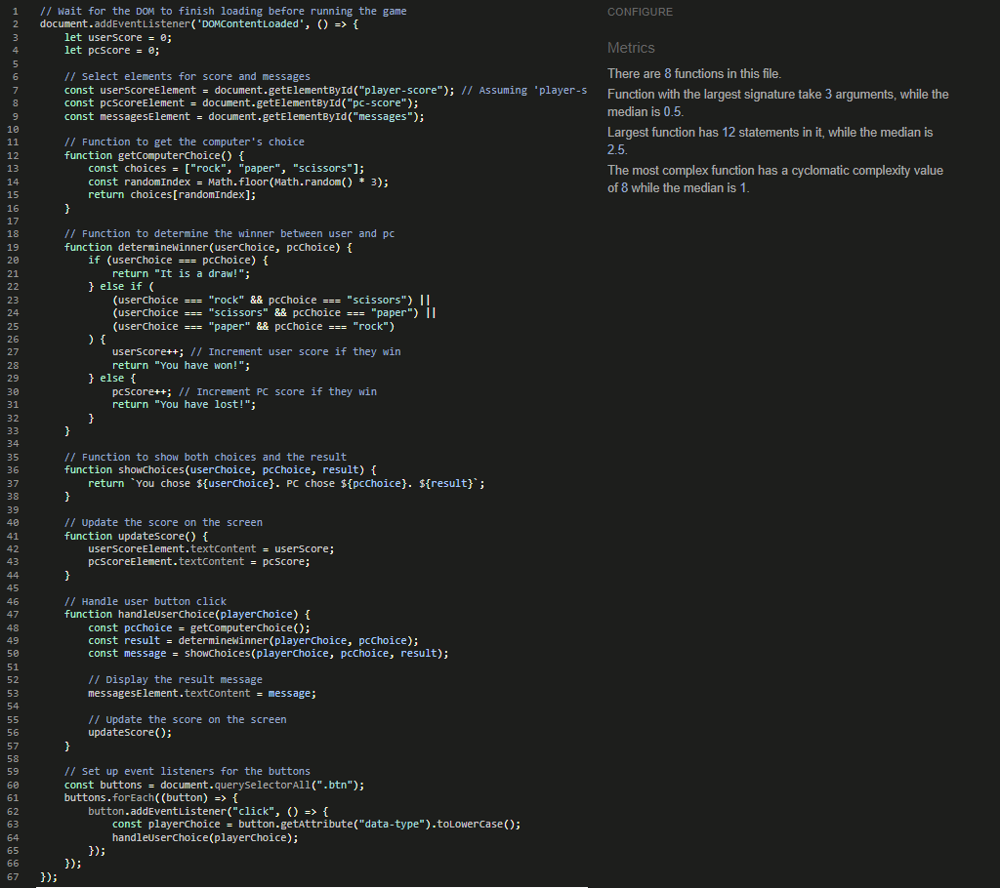

# Rock, Paper, Scissors!

Rock, Paper, Scissors is a game that can be played by almost people of any age. This website allows friends, family, or even people having a spare 10-15mins on their dinner break, to particapte in a classic game of rock paper scissors against the computer.

This is a one page website using contrasting colours such as pink, grey and white. the rock paper scissors icons have bright colours of red, blue and green to further distinguish the differences between the choices.

Welcome to [Rock, Paper, Scissors!](https://mattwass.github.io/Project-2/)

## Features:

- Header 
  - The Header displays the title of the game, using a salmon pink colour.

- The Game Area 
  - This section diplays the choice of either Rock, Paper or Scissors to go up against the computer.
  - Upon clicking the relavant action, the computer will also show what they have chosen. Whoever has won will receive a point. If both the player and the computer are to make the same choice, then no point shall be awarded.
  - This can be seen in the exmaple below. where we can see that the player won the game, as a they chose rock, whereas the computer chose scissors. "You have won!" is then displayed to confirm that the player has won that round.

  

  - This time we can see in the image below that it is a draw as both the player and the PC chose paper. 

   

    - This time we can see in the image below that the Computer has won and the player has lost. 

    

- The Outcome
  - The winner is defined by answering the correct outcome to a given match up, this naturally creates a losing side.
  - If both sides select the same choice then result is defined as a draw.

- The Footer
  - Down the bottom of the page the rules can be seen, displaying how one would win depending upon the choices they select.
  - Rock beats Scissors, Scissors beats Paper and Paper beats Rock.

## Testing
- I have tested that the webpage works in different browsers: 
  - Microsoft Edge
  - Google Chrome
  - Mozilla Firefox

- I can confirm that the webpage is responsive on various screen sizes, using the devtools device toolbar. I tested this with an iphone 12 pro and an iphone 14 pro max in devtools.
- I can confirm  that all sections of the webpage are clear, easy to read and understand.

### Bugs

Solved Bugs
- I could not get my favicon to display due to not having the correct code attached to it. Tutor Support helped me with this and added in the relevant line of code so that my favicon would display.
- I also had an error passing my JavaScript through the validator but realised again through the guidance of tutor support, that I had not configured the settings to accomodate for new JavaScript features.

### Validation

- HTML
  - The webpage passes in the html validator

  

- CSS
  - The webpage passes in the css jigsaw validator 

 

 - JavaScript

   - The webpage passes in the JSHint validator 

 

- Accessibility:
  - The webpage scores relatively well in the lighthouse report.

### Unfixed Bugs

  - No bugs that are unfixed

## Deployment

 The webpage has been deployed to GitHub pages with the steps below:
  - From the GitHub repository navigate to the settings tab
  - From the source section select Master Branch
  - From the Master Branch been selected the link is provided to the website

## Acknowledgements

- Tutor Support for guidance with my Favicon not displaying and adding in the relevant line of code for me so it worked.
- Student Care, for all their support and guidance over what has been a very challenging time for myself and my family over the last month.

### Content

- Inspiration for my project was taken from the JavaScript Essentials modules  as well as the Love Maths project I took part in. 
- The knowledge and use of font awesome icons and favicons was used following prior knowledge gained earlier in the course. 

### Media

- Font Awesome Icons from [Font Awesome Icons](https://fontawesome.com/icons)
- Google Font from [Google Fonts](https://fonts.google.com/)